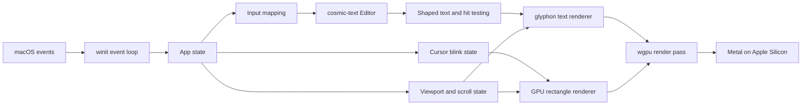

# A Small Rust Editor: Build Walkthrough

This document is the roadmap for building a small, fast, native code editor for macOS. The project is both a usable personal tool and a guided way to learn Rust through a real application.

We will build one milestone at a time. At the end of every milestone, we will run its checks, summarize the Rust concepts it introduced, and stop for review before continuing.

## Progress

| Milestone | Status |
| --- | --- |
| 0: Project foundation | Approved and committed (`fa94010`) |
| 1: Native window and Metal surface | Approved and committed (`c9cee43`) |
| 2: GPU shapes and text | Approved and committed (`f33a3d1`) |
| 3: Scratch-buffer editing and line numbers | Implemented and verified; awaiting review |
| 4: Mouse selection | Not started |
| 5: VS Code-style block cursor | Not started |
| 6: MVP hardening | Not started |

### Milestone 1 review record

- `ApplicationHandler` owns native lifecycle and routes only events for the editor window.
- `GpuState` owns the Metal instance, surface, device, queue, surface configuration, and window lifetime.
- The window stays hidden until its surface is configured and a redraw is requested.
- The event loop waits while idle instead of continuously polling.
- Zero-sized windows suspend surface rendering without passing invalid dimensions to `wgpu`.
- Outdated, lost, suboptimal, timed-out, and occluded surface states have explicit recovery behavior.
- Debug startup output identified `Apple M4 Pro (IntegratedGpu) via Metal`.
- Formatting, compilation, Clippy with denied warnings, and three lifecycle tests pass.
- The native window presented, resized, and exited cleanly during interactive verification.

### Milestone 2 review record

- `EditorPreview` owns the temporary `cosmic-text` buffers, font system, and glyph cache.
- `Renderer` owns the reusable rectangle pipeline, `glyphon` viewport, atlas, and text renderer.
- A small instanced WGSL pipeline batches the gutter and divider into one rectangle draw call.
- Line numbers and code use separate buffers and clip bounds, so editor text cannot draw into the gutter.
- Layout stays in logical points until the rendering boundary, where rectangles and text scale to physical Retina pixels.
- The `#1e1e1e` theme colors are converted from sRGB to linear values before writing to the sRGB swapchain; `glyphon` performs accurate text-color conversion itself.
- The glyph atlas and rectangle allocations are reused across redraws.
- Formatting, compilation, Clippy with denied warnings, and five lifecycle/rendering tests pass.
- The gutter, divider, line numbers, and Menlo sample rendered, resized, and exited cleanly on the Apple M4 Pro Metal adapter.

### Milestone 3 review record

- The temporary preview is replaced by an owned `cosmic_text::Editor` scratch buffer.
- Raw key events are translated into editor intentions in `input.rs`; layout-dependent keyboard mappings do not use physical key positions.
- Text, Enter, four-space Tab, Backspace, and four arrow motions update the buffer through `cosmic-text` editing primitives.
- Command- and Control-modified text is suppressed so unimplemented shortcuts cannot insert stray characters; Option-modified Unicode remains valid text.
- Committed macOS IME text is accepted, while pre-edit UI remains a later hardening task.
- Line-number text is regenerated only when the logical line count changes, and the gutter can grow at larger digit counts.
- `cosmic-text` keeps the insertion point visible horizontally and vertically; the line-number buffer mirrors only its vertical scroll.
- Live resize now configures and presents a new frame inside the resize event instead of leaving AppKit to stretch the previous swapchain image while a redraw waits in the queue.
- Formatting, compilation, Clippy with denied warnings, and sixteen editor/input/rendering tests pass.
- Live typing, scrolling, line-number updates, resizing, and shutdown completed without Metal or text-engine errors.

## Product brief

The first release is deliberately narrow: a single native window containing one in-memory scratch editor.

It will support:

- Multiline text entry
- A fixed-width line-number gutter
- A blinking, character-width block cursor with normal insert behavior
- Arrow-key movement
- Backspace
- Click-and-drag mouse selection
- Automatic scrolling to keep the cursor visible
- A dark theme, Menlo, four-space indentation, and no line wrapping
- Retina displays and window resizing

It will not yet support:

- Opening or saving files
- Syntax highlighting
- Undo and redo
- Copy and paste
- Keyboard-extended selection
- Tabs or split panes
- Language servers
- An integrated terminal
- Settings UI
- Visible scrollbars

Those are future increments, not hidden requirements for the first release.

## Decisions we have made

| Area | Decision | Reason |
| --- | --- | --- |
| Platform | macOS first | It is the development and initial work platform. |
| CPU target | Apple Silicon (`aarch64-apple-darwin`) | It is the primary hardware target. |
| Language | Stable Rust | Native performance, strong correctness tools, and the learning goal. |
| Windowing | `winit` | It exposes native window, lifecycle, keyboard, mouse, focus, and scale-factor events without a web view. |
| GPU | `wgpu`, Metal backend | It gives us a modern Rust GPU API that maps to Metal on macOS. |
| Text | `glyphon` with its `cosmic-text` re-export | `cosmic-text` supplies shaping and editing primitives; `glyphon` caches and renders its glyphs through `wgpu`. |
| Editor storage | `cosmic_text::Editor` for the MVP | It is sufficient for a scratch buffer and avoids introducing a second document model too early. |
| Rendering cadence | On demand | We redraw for changes, resize, selection dragging, and cursor blink instead of running a permanent 60 FPS loop. |
| Defaults | Dark, Menlo, four spaces, no wrap | Sensible code-editor defaults for the initial user. |
| Review style | Stop after every milestone | Each slice should be understandable and verified before the next abstraction arrives. |

## Dependency set

The initial compatible family is:

```toml
winit = "0.30"
wgpu = "30"
glyphon = "0.12"
pollster = "0.4"
bytemuck = { version = "1", features = ["derive"] }
```

`glyphon` 0.12 depends on `wgpu` 30 and `cosmic-text` 0.19. We will use types from `glyphon`'s `cosmic-text` re-export instead of adding a separate direct `cosmic-text` dependency. This keeps the renderer and editor on exactly the same text-engine types.

When we scaffold the project, `Cargo.lock` will capture the exact working versions. We will not upgrade dependencies in the middle of the MVP unless a concrete bug requires it.

References:

- [`winit` documentation](https://docs.rs/winit/latest/winit/)
- [`wgpu` documentation](https://docs.rs/wgpu/latest/wgpu/)
- [`glyphon` documentation](https://docs.rs/glyphon/latest/glyphon/)
- [`cosmic-text` Editor documentation](https://docs.rs/cosmic-text/latest/cosmic_text/struct.Editor.html)

## Architecture



The intended source layout is small and responsibility-driven:

```text
src/
  main.rs        Application entry point
  app.rs         winit lifecycle and event routing
  gpu.rs         wgpu instance, surface, device, queue, and resize
  render.rs      Render ordering and solid-rectangle pipeline
  editor.rs      Text buffer, editing operations, hit testing, and gutter text
  input.rs       Keyboard and mouse events translated into editor intentions
  cursor.rs      Blink timing and cursor visibility
  theme.rs       Fonts, sizes, spacing, and colors
shaders/
  rectangles.wgsl
```

This is an initial boundary, not a mandate to create empty abstractions. A file should appear only when its responsibility is real.

## Render model

Each frame follows a predictable order:

1. Clear the swapchain texture to the editor background.
2. Draw solid rectangles for the gutter, active selection, and visible block cursor.
3. Draw line numbers and editor text with `glyphon`.
4. Present the surface.

Solid shapes use a tiny WGSL pipeline and an instanced unit quad. The CPU sends a compact list of rectangles; the GPU expands and colors them. Text glyphs are stored in `glyphon`'s GPU atlas rather than uploaded from scratch every frame.

The cursor is one monospace cell wide, including at the end of a line. It is drawn behind the character so the character remains legible. A later polish pass can add exact foreground-color inversion under the cursor if the initial contrast is not close enough to VS Code.

We will explicitly request `wgpu::Backends::METAL`. That makes the macOS-first decision visible in code instead of relying on backend auto-selection.

## Coordinate rule

macOS and `winit` expose both logical sizes and physical pixel sizes. Retina errors usually come from mixing them throughout a renderer.

Our rule is:

- Editor layout, hit testing, font sizes, gutter width, and mouse positions use logical points.
- Surface textures, GPU viewports, and physical scissor bounds use physical pixels.
- Conversion happens at the rendering boundary using the window's current scale factor.

Scale-factor changes invalidate the surface configuration, text viewport, and any cached physical rectangle instances.

## Input rule

Keyboard handling separates commands from text:

- Named keys map to editor actions: arrows, Backspace, Enter, and Tab.
- Produced text and committed IME text are inserted as text.
- Tab inserts four spaces in the MVP.
- Pressing a movement or editing key resets the cursor blink to visible.
- Typing while text is selected replaces the selection.

Mouse handling uses the text engine's layout hit testing:

- A primary-button press converts the pointer position into a text cursor and starts a selection anchor.
- Pointer movement while pressed updates the active end of the selection.
- Releasing the button completes the selection.
- Pointer coordinates are translated past the gutter before hit testing.

## Cursor behavior

The block is a visual insertion cursor, not overwrite mode.

- It begins visible.
- It alternates visible and hidden on a roughly half-second cadence.
- Any edit, movement, click, or drag makes it immediately visible and restarts the timer.
- It is hidden when the window is unfocused.
- The event loop sleeps until the next real event or blink deadline; it does not busy-loop.
- A cursor move automatically adjusts scroll just enough to keep the cell inside the viewport.

## Milestone 0: Project foundation

### Build

- Create a binary Cargo project with the working package name `editor`.
- Add the compatible dependency set and commit the lockfile.
- Add the module skeleton only as each module becomes needed.
- Configure normal Rust hygiene: formatting, Clippy, and tests.

### Rust concepts

- Cargo packages, crates, dependencies, and feature flags
- `Result` and error propagation
- Modules and visibility
- Why a lockfile belongs in an application repository

### Verify

```bash
cargo fmt --check
cargo check
cargo clippy --all-targets --all-features -- -D warnings
cargo test
```

### Review checkpoint

Review the manifest, module boundary, and compiler output. Do not build the window until this milestone is accepted.

## Milestone 1: Native window and Metal surface

### Build

- Implement `winit::application::ApplicationHandler`.
- Create the window during the resumed lifecycle event, as required by modern `winit`.
- Initialize a Metal-only `wgpu` instance, surface, adapter, device, and queue.
- Give GPU resources useful debug labels.
- Record the selected adapter name and backend at startup in debug builds.
- Configure the surface using the window's physical dimensions.
- Clear every requested frame to the theme background color.
- Handle resize, scale-factor change, close, and recoverable surface errors.

The window will be retained through an `Arc`. This makes the ownership relationship between the native window and the GPU surface explicit and lets the surface safely remain in application state.

### Rust concepts

- Trait implementations and event-driven control flow
- Ownership shared through `Arc`
- Lifetimes around resources backed by an OS window
- Async GPU initialization bridged at startup with `pollster`
- Exhaustive matching and recoverable errors

### Verify

- `cargo run` opens exactly one resizable macOS window.
- The debug adapter report says Metal and identifies the Apple GPU.
- Resizing never panics or produces persistent corruption.
- Closing the window exits cleanly.
- The standard format, check, Clippy, and test commands pass.

### Review checkpoint

Review the event lifecycle and explain the ownership of the window, surface, device, and queue before proceeding.

## Milestone 2: GPU shapes and text

### Build

- Add the small instanced-rectangle WGSL pipeline.
- Render the gutter as a GPU rectangle.
- Initialize `glyphon`'s font system, cache, viewport, atlas, and text renderer.
- Load an empty multiline buffer using Menlo with the agreed font metrics.
- Render a short temporary text sample and line number to prove the complete text path.
- Clip editor text to the editor viewport so it never draws over the gutter.

The temporary sample is scaffolding and will disappear when real editing arrives.

### Rust concepts

- GPU buffers, render pipelines, shaders, and render passes
- Plain-data vertex/instance types with `bytemuck`
- Borrowing several renderer resources during one frame
- Caches and why glyph atlases matter
- Logical versus physical coordinates

### Verify

- Background, gutter, sample line number, and sample code render sharply.
- The layout remains correct across window resizing and Retina scale changes.
- GPU validation reports no errors.
- Redraw occurs on demand rather than continuously.

### Review checkpoint

Review one captured frame and trace a glyph and a rectangle from application data to Metal output.

## Milestone 3: Scratch-buffer editing and line numbers

### Build

- Replace the sample with a real `cosmic_text::Editor`-backed scratch buffer.
- Translate text input, Enter, Tab, Backspace, and four arrow keys into editing operations.
- Disable line wrapping.
- Delete the active selection before inserting new text or applying Backspace.
- Generate right-aligned line numbers from the buffer's logical lines.
- Recompute gutter width when the number of digits grows.
- Keep the cursor position visible through minimal vertical and horizontal scrolling.

### Rust concepts

- Modeling input as intentions rather than mutating state inside raw event matches
- UTF-8 byte indices versus user-visible grapheme movement
- Mutable borrowing of the editor and font system
- Derived state and cache invalidation
- Small pure functions that are easy to test

### Verify

- Normal and Unicode text can be entered on multiple lines.
- Arrow movement behaves correctly at line starts, line ends, and empty lines.
- Backspace handles characters, line joins, and selection deletion.
- Tab inserts four spaces.
- Line numbers add and disappear with lines and remain aligned.
- The cursor never becomes permanently unreachable outside the viewport.

### Review checkpoint

Review editing edge cases and inspect how `cosmic-text` protects us from implementing Unicode cursor movement ourselves.

## Milestone 4: Mouse selection

### Build

- Track logical pointer position and primary-button state.
- Hit-test clicks after subtracting gutter and padding offsets.
- Place the cursor on click.
- Maintain an anchor and active end while dragging.
- Draw selection rectangles behind selected glyphs.
- Preserve selection across forward and backward drags and across line boundaries.
- Scroll when dragging just outside the visible editor area if this can be added without destabilizing the milestone; otherwise record it as the first follow-up.

### Rust concepts

- Explicit interaction state machines
- Coordinate transforms
- Ordered ranges and direction-independent selections
- Separating model selection from its rendered rectangles

### Verify

- Clicking at the start, middle, and end of a line places the cursor correctly.
- Dragging in either direction selects the intended text.
- Dragging across lines produces continuous selection.
- Typing replaces selected text.
- Backspace deletes selected text.

### Review checkpoint

Review selection behavior manually and inspect tests for coordinate translation and ordered ranges.

## Milestone 5: VS Code-style block cursor

### Build

- Derive a cursor rectangle from the shaped cursor position and monospace cell width.
- Draw the block behind the character at the insertion point.
- Implement focused, visible, and hidden cursor states.
- Schedule blink transitions with `ControlFlow::WaitUntil` or the equivalent current `winit` mechanism.
- Restart the visible phase after input, movement, clicking, and dragging.
- Stop blinking and hide the cursor when unfocused.
- Tune color and contrast against the default theme.

### Rust concepts

- Time-based state without a game loop
- `Instant`, deadlines, and event-loop wakeups
- State transitions expressed as testable logic
- Rendering derived UI without storing duplicate geometry

### Verify

- The cursor is a full character cell, including at end of line.
- It blinks without making the entire application run continuously.
- It becomes visible immediately after every interaction.
- It does not change insertion into overwrite behavior.
- The character beneath the block remains readable.
- Focus changes behave correctly.

### Review checkpoint

Review the blink-state tests and compare the cursor visually with VS Code's block cursor.

## Milestone 6: MVP hardening

### Build

- Audit zero-sized windows and minimized-window surface handling.
- Verify IME commit behavior and ordinary Unicode input on macOS.
- Remove temporary allocations in the render path where they are measurable or obvious.
- Add debug-only frame and adapter diagnostics without noisy normal output.
- Document controls and current limitations in the README.
- Run the full quality suite and perform a release build.

### Rust concepts

- Debug versus release behavior
- Measurement before optimization
- Defensive handling of OS and GPU lifecycle edge cases
- The difference between compile-time checks and interactive QA

### Verify

```bash
cargo fmt --check
cargo check
cargo clippy --all-targets --all-features -- -D warnings
cargo test
cargo build --release
```

Manual acceptance:

- Launches as a native Apple Silicon application process.
- Opens one responsive editor window.
- Types and edits multiline scratch text.
- Displays correct line numbers.
- Supports arrow movement, Backspace, and mouse selection.
- Shows a focused, blinking block insertion cursor.
- Keeps the cursor visible as the buffer grows.
- Survives resize, Retina scaling, minimize/restore, and focus changes.
- Does not continuously redraw while idle between blink transitions.

### Review checkpoint

The MVP is complete only after the manual acceptance list and automated checks pass. Future editor features begin after this review, not as part of hardening.

## Testing strategy

The OS window and final pixels need manual verification, but most behavior should not require a window to test.

Unit-test candidates include:

- Key-to-intention mapping
- Four-space Tab insertion
- Blink state transitions and deadlines
- Cursor reset after interaction
- Gutter width as line-count digits increase
- Logical-to-physical coordinate conversion
- Pointer-to-editor coordinate translation
- Forward and backward selection ordering
- Scroll adjustments that keep the cursor visible

Interactive checks cover:

- Actual Metal adapter selection
- Font appearance and cursor contrast
- Retina sharpness
- Mouse hit-testing feel
- Window lifecycle and focus behavior
- IME integration

## Performance budget for the MVP

The goal is not to benchmark an empty editor into meaninglessness. The goal is to avoid architectural waste:

- No web runtime or embedded browser
- Metal rendering through `wgpu`
- Glyph atlas reuse through `glyphon`
- Batched rectangles rather than one GPU submission per shape
- Redraw only when state or blink visibility changes
- Layout only after buffer, viewport, font, or scroll changes
- No full document clone during a keystroke or frame

Once file loading exists, we will establish real measurements for launch time, input-to-frame latency, large-file memory, and scroll performance. That is also the point to evaluate moving document storage to a rope while retaining `cosmic-text` for visible layout.

## Likely next increments

After the MVP, a sensible order is:

1. Clipboard operations and keyboard selection
2. Undo and redo
3. Open and save one file
4. Mouse-wheel and trackpad scrolling with visible scroll state
5. Syntax highlighting
6. Multiple buffers and tabs
7. Search
8. Language-server integration

We will reassess that order after using the scratch editor. The tool should grow in response to real friction rather than an assumed checklist of IDE features.
