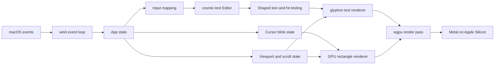

# A Small Rust Editor: Build Walkthrough

This document is the roadmap for building a small, fast, native code editor for macOS. The project is both a usable personal tool and a guided way to learn Rust through a real application.

We will build one milestone at a time. At the end of every milestone, we will run its checks, summarize the Rust concepts it introduced, and stop for review before continuing.

## Progress

| Milestone | Status |
| --- | --- |
| 0: Project foundation | Approved and committed (`fa94010`) |
| 1: Native window and Metal surface | Approved and committed (`c9cee43`) |
| 2: GPU shapes and text | Approved and committed (`f33a3d1`) |
| 3: Scratch-buffer editing and line numbers | Approved and committed (`fca2194`) |
| 4: Mouse selection | Approved and committed (`2d7430e`) |
| 5: VS Code-style block cursor | Approved and committed (`f3833be`) |
| 6: MVP hardening | Approved and committed (`fd0d9bd`) |

### Phase 2 progress

| Milestone | Status |
| --- | --- |
| 7: File lifecycle | Approved and committed (`883d365`) |
| 8: Commands, selection, and clipboard | Approved and committed (`72dc051`) |
| 9: Undo and redo | Approved and committed (`f2396e4`) |
| 10: Tabs | Approved and committed (`152f1ad`) |
| 11: Python syntax highlighting | Approved and committed (`b31a117`) |
| 12: Python LSP diagnostics | Approved and committed (`53c72af`) |
| 13: Interactive LSP features | Approved and committed (`5c9fb4a`) |

### Milestone 1 review record

- `ApplicationHandler` owns native lifecycle and routes only events for the editor window.
- `GpuState` owns the Metal instance, surface, device, queue, surface configuration, and window lifetime.
- The window stays hidden until its surface is configured and a redraw is requested.
- The event loop waits while idle instead of continuously polling.
- Zero-sized windows suspend surface rendering without passing invalid dimensions to `wgpu`.
- Outdated, lost, suboptimal, timed-out, and occluded surface states have explicit recovery behavior.
- Debug startup output identified `Apple M4 Pro (IntegratedGpu) via Metal`.
- Formatting, compilation, Clippy with denied warnings, and three lifecycle tests pass.
- The native window presented, resized, and exited cleanly during interactive verification.

### Milestone 2 review record

- `EditorPreview` owns the temporary `cosmic-text` buffers, font system, and glyph cache.
- `Renderer` owns the reusable rectangle pipeline, `glyphon` viewport, atlas, and text renderer.
- A small instanced WGSL pipeline batches the gutter and divider into one rectangle draw call.
- Line numbers and code use separate buffers and clip bounds, so editor text cannot draw into the gutter.
- Layout stays in logical points until the rendering boundary, where rectangles and text scale to physical Retina pixels.
- The `#1e1e1e` theme colors are converted from sRGB to linear values before writing to the sRGB swapchain; `glyphon` performs accurate text-color conversion itself.
- The glyph atlas and rectangle allocations are reused across redraws.
- Formatting, compilation, Clippy with denied warnings, and five lifecycle/rendering tests pass.
- The gutter, divider, line numbers, and Menlo sample rendered, resized, and exited cleanly on the Apple M4 Pro Metal adapter.

### Milestone 3 review record

- The temporary preview is replaced by an owned `cosmic_text::Editor` scratch buffer.
- Raw key events are translated into editor intentions in `input.rs`; layout-dependent keyboard mappings do not use physical key positions.
- Text, Enter, four-space Tab, Backspace, and four arrow motions update the buffer through `cosmic-text` editing primitives.
- Command- and Control-modified text is suppressed so unimplemented shortcuts cannot insert stray characters; Option-modified Unicode remains valid text.
- Committed macOS IME text is accepted, while pre-edit UI remains a later hardening task.
- Line-number text adds blank continuation rows when wrapping changes, and the gutter can grow at larger logical line counts.
- `cosmic-text` keeps the insertion point visible vertically as wrapped lines flow through the viewport; the line-number buffer mirrors that visual scroll.
- Live resize now configures and presents a new frame inside the resize event instead of leaving AppKit to stretch the previous swapchain image while a redraw waits in the queue.
- Formatting, compilation, Clippy with denied warnings, and sixteen editor/input/rendering tests pass.
- Live typing, scrolling, line-number updates, resizing, and shutdown completed without Metal or text-engine errors.

### Milestone 4 review record

- Pointer positions are converted from physical Retina pixels to logical window points once in `input.rs`.
- Primary-button presses create click intentions, pointer movement while pressed creates drag intentions, and focus loss cancels an active drag.
- Window-space positions are translated past the dynamic gutter and top padding before `cosmic-text` performs text-layout hit testing.
- `cosmic-text` remains the source of truth for forward and backward selection ranges and selection replacement/deletion.
- Plain Left and Right arrows clear an existing selection anchor and collapse to its start or end; other plain motions clear the anchor before moving, preventing a stale selection from reappearing.
- Selection rectangles are derived from shaped layout runs, including disjoint spans for mixed-direction text and line-edge extension for multiline selections.
- Derived rectangles are clipped to the editor viewport before entering the instanced GPU rectangle batch, so wrapped content cannot paint over the gutter.
- Formatting, compilation, Clippy with denied warnings, and twenty-two editor/input/rendering tests pass.
- Click placement, bidirectional drag selection, multiline selection, replacement, deletion, and shutdown completed without Metal or text-engine errors.
- Dragging outside the visible viewport to auto-scroll is deferred as the first interaction follow-up after the MVP.

### Milestone 5 review record

- `CursorBlink` is a standalone state machine with focused, visible, hidden, and next-deadline state.
- The event loop sleeps with `ControlFlow::WaitUntil` and wakes only once per 530 ms blink phase rather than polling continuously.
- Typing, keyboard motion, clicking, and dragging reset the cursor to visible and restart its deadline.
- Losing focus hides the cursor and removes its timer; regaining focus starts a fresh visible phase.
- Focus loss and pointer exit discard stale pointer coordinates, so a macOS activation press cannot relocate the text cursor to the previous mouse position.
- Cursor position and width come from shaped layout runs, using the exact grapheme cell advance when available and a one-cell fallback on empty lines or layout edges.
- The GPU draws the block behind text, then `glyphon` redraws only the glyph region inside the block in the editor background color to preserve contrast.
- Cursor and text-overlay bounds use the same editor-to-window translation and viewport clipping as selections.
- Formatting, compilation, Clippy with denied warnings, and twenty-nine cursor/editor/input/rendering tests pass.
- Blink timing, interaction resets, empty-line and end-of-line width, glyph contrast, focus transitions, and shutdown completed without Metal or text-engine errors.

### Milestone 6 review record

- Zero-sized windows suspend surface acquisition and restore by configuring the latest non-zero extent; lost, outdated, suboptimal, timed-out, and occluded frames retain explicit recovery behavior.
- Committed IME text now passes through the testable input-intention boundary, while pre-edit text remains an explicitly documented future feature.
- Ordinary composed, CJK, and emoji text is preserved by the scratch buffer.
- Selection geometry consumes shaped highlight spans directly instead of allocating a temporary vector for every selected layout run.
- Debug builds report the Metal adapter and first presented frame once; release builds compile those diagnostics out.
- The README documents every MVP control, its debug behavior, and the current limitations.
- Formatting, compilation, Clippy with denied warnings, thirty-one tests, and an optimized `arm64` release build pass.

### Milestone 7 review record

- A `Documents` collection owns editor instances from the beginning, while this first file iteration deliberately exposes only one active document.
- Each `Document` owns its path, dirty state, and `EditorState`; an untitled scratch document is the stable fallback.
- Native macOS Open, Save, Save As, warning, and error panels come from `rfd` and are parented to the editor window.
- Cmd+O, Cmd+S, and Cmd+Shift+S cross a file-command boundary instead of being treated as text input.
- `cosmic-text` change records distinguish actual edits from cursor motion and selection, so the native window edited indicator is accurate.
- Opening a document preserves its decoded UTF-8 text and line endings; a successful save updates its path and clears dirty state.
- Opening over or closing a dirty document offers Save, Discard, and Cancel paths; cancelled or failed saves do not discard text.
- The window title follows the active filename and macOS receives the native document-edited state.
- Formatting, compilation, Clippy with denied warnings, thirty-six tests, and the optimized release build pass.

### Milestone 8 review record

- Raw key events now produce distinct file, editor, clipboard, and text-editing intentions.
- Plain Shift+Arrow extends a normal selection from a stable anchor; releasing Shift and moving clears or collapses it with standard insertion-cursor behavior.
- Option+Left/Right uses Unicode-aware word boundaries, while Option+Up/Down uses paragraph boundaries.
- Cmd+Left/Right targets line boundaries and Cmd+Up/Down targets document boundaries; every movement supports a Shift selection variant.
- Cmd+A selects the complete buffer across Unicode and multiple lines.
- Cmd+C/X/V use a lazily initialized macOS pasteboard through a small `ClipboardProvider` interface.
- Copy and cut are no-ops without a selection, cut deletes only after a successful pasteboard write, and paste replaces a selection through the normal editor-change path.
- The production clipboard uses text-only `arboard` features, avoiding image codecs and persistent polling; behavioral tests use an in-memory provider.
- Formatting, compilation, Clippy with denied warnings, forty-one tests, and the optimized release build pass.

### Milestone 9 review record

- Every recorded edit stores the reversible `cosmic-text` change plus cursor and selection state from before and after it.
- Per-document history owns an applied position, redo tail, saved pivot, and current coalescing group.
- Consecutive single-character typing within 750 ms coalesces into one transaction; a pause starts another, and consecutive Backspace operations form a separate transaction.
- Newlines, indentation, IME commits, selection replacement, cut, and paste are standalone transactions.
- Cursor motion, selection changes, pointer interaction, clipboard commands, saving, focus loss, undo, and redo close the current group.
- Undo applies grouped changes in reverse order, redo applies them forward, and both perform one final layout/line-number synchronization.
- Editing after undo truncates the redo branch; if that branch contained the saved pivot, the saved state is correctly marked unreachable.
- Dirty state is derived from whether the current history position equals the saved pivot, so undoing back to disk clears the native edited indicator and moving past it marks the document dirty again.
- Formatting, compilation, Clippy with denied warnings, forty-nine tests, and the optimized release build pass.

### Milestone 10 review record

- The existing document collection now exposes multiple independent editor, cursor, selection, scroll, and history states through one active index.
- The first Open replaces a clean empty scratch tab; later opens append tabs, while reopening a canonical path switches to its existing tab without rereading or duplicating it.
- Save As refuses a canonical path already owned by another tab, preventing two live buffers from silently targeting the same file.
- The GPU rectangle batch draws active and inactive tab backgrounds plus a divider, while clipped text areas draw filenames and dirty markers from a reusable buffer.
- Tab widths share the available window width up to a comfortable maximum, keeping every tab hit-testable as the window narrows.
- Pointer clicks and Cmd+Shift+[ / ], Control+Tab, and Control+Shift+Tab switch active documents and synchronize the titlebar and native edited state.
- Cmd+W protects only the active dirty document, selects a neighboring tab after close, and creates a fresh Untitled document after the final tab closes.
- Closing the window walks every dirty tab through Save, Don't Save, or Cancel without silently discarding an inactive document.
- Formatting, compilation, Clippy with denied warnings, fifty-three tests, and the optimized release build pass.

### Milestone 11 review record

- `.py` and `.pyi` documents own a Tree-sitter Python parser, retained syntax tree, highlight query, query cursor, source mirror, and reusable span vector; other files remain parser-free plain text.
- Editor change records are translated into Tree-sitter `InputEdit` byte and point ranges, including multiline insertions, deletions, selection replacement, Unicode, undo, and redo.
- Multiple changes in one undo/redo transaction edit the existing tree first and trigger only one incremental reparse and one final text-layout synchronization.
- The bundled Python highlight query maps comments, strings, keywords, functions, types, numbers, built-ins, constants, operators, and attributes into the editor's dark palette.
- Absolute query byte ranges are clipped into per-line `cosmic-text` attribute spans while retaining Menlo, selection rectangles, scrolling, and the block cursor.
- Saving an untitled or plain document as `.py` enables highlighting immediately; Save As to a non-Python extension removes syntax attributes and parser state.
- Parser and query state live per document, so switching tabs preserves each Python syntax tree without reparsing inactive files.
- Formatting, compilation, Clippy with denied warnings, fifty-eight tests, and the optimized release build pass.

### Milestone 12 review record

- `LspManager` discovers `pyright-langserver` through `PATH`, starts it only when a named Python document exists, and reports one clear native error without preventing ordinary editing when Pyright is unavailable.
- A writer thread and reader thread own the server's stdio pipes; `Content-Length` framing carries JSON-RPC messages without blocking the macOS event loop.
- Initialization uses the nearest `pyrightconfig.json`, `pyproject.toml`, or Git root, falling back to the Python file's directory.
- Every open `.py` and `.pyi` tab is synchronized with `didOpen`, full-document versioned `didChange`, `didSave`, and `didClose` notifications.
- Full-document synchronization is deliberate for this first protocol milestone: it keeps the client correct and inspectable while Tree-sitter remains incremental on the local editing path.
- Background diagnostics return through a typed `winit` user event; versioned results that do not match the latest synchronized document are discarded.
- LSP UTF-16 line/character positions are converted to UTF-8 byte offsets at Unicode scalar boundaries, including safe handling of surrogate-pair positions and CRLF content.
- Error, warning, information, and hint ranges become clipped GPU underline rectangles; any edit clears prior geometry until a fresh diagnostic publication arrives.
- Shutdown sends `shutdown`, waits briefly for its response, sends `exit`, and only force-terminates the child if it does not exit within the bounded grace period.
- Formatting, compilation, Clippy with denied warnings, sixty-five tests, and the optimized release build pass. Live Pyright verification remains pending because `pyright-langserver` is not installed on the development machine.

### Milestone 13 review record

- Ctrl+Space requests completions at the active Python cursor; a GPU-rendered menu shows up to eight rows and keeps the selected item visible while Up and Down navigate.
- The macOS shortcut path accepts `winit`'s real `NamedKey::Space` event shape, and unavailable buffers or a still-starting Pyright server display an explanatory notice instead of failing silently.
- Enter and Tab accept the selection as one undoable edit, Escape dismisses it, and server-provided UTF-16 text-edit ranges take precedence over the local identifier-prefix fallback.
- Cmd+I requests hover information and displays normalized plaintext or markup content in a bounded GPU tooltip near the shaped cursor cell.
- F12 requests a definition, opens or switches to the target file through the existing tab model, converts its UTF-16 target position, and places the cursor without modifying the document.
- The completion and hover surfaces reuse the editor's font system, glyph atlas, rectangle batch, Retina conversion, and viewport clipping instead of introducing a second UI toolkit.
- Completion documentation is shown for the keyboard-selected or mouse-hovered item, including documentation fetched lazily through `completionItem/resolve` when the initial result omits it.
- Overlay backgrounds and text use a final render layer after the editor glyph pass, so opaque menus fully cover the code beneath them instead of blending both text surfaces.
- Every interactive request records its document URI and synchronized version. Edits reject version-stale responses; cursor movement, selection, tab changes, Escape, and superseding requests send `$/cancelRequest` and remove pending identities.
- Responses also verify that their source path is still active before displaying UI or navigating, preventing a result from one tab from affecting another.
- Formatting, compilation, Clippy with denied warnings, seventy-one tests, and the optimized release build pass. Live Pyright interaction verification remains pending because `pyright-langserver` is not installed on the development machine.

### Milestone 13 refinement record

- The completion surface uses a stable two-pane footprint: suggestions remain on the left and documentation updates independently on the right, so lazy documentation cannot resize or relocate the menu.
- Suggestion and documentation buffers cache their last text; moving within the visible window normally updates only the selected GPU rectangle instead of resetting and reshaping every popup glyph.
- Mouse-wheel line deltas and Retina-correct trackpad pixel deltas scroll the wrapped document vertically while preserving its cursor and selection.
- While completion is open, the same vertical deltas navigate its full item list; fractional trackpad movement accumulates until it crosses one row and selection remains clamped at both ends.
- Line numbers mirror manual vertical scrolling across both logical and wrapped continuation rows.
- Scroll input is clamped against the wrapped document's explicit vertical content extent before state is mutated; repeated trackpad noise at the top or bottom boundary becomes a true no-op.
- Small proportional GPU scrollbar thumbs appear for each overflowing document axis and for completion lists longer than their eight-row viewport; non-overflowing content has no unnecessary bar.
- Scrollbars render in the final overlay pass, staying visible above code while remaining beneath completion surfaces that cover them.
- Formatting, compilation, Clippy with denied warnings, seventy-six tests, and the optimized release build pass.

## Phase 2 product brief

Phase 2 turns the scratch editor into a small Python-focused working editor. Its document model grows into tabs, its input mapping grows into standard macOS editing commands, and language intelligence is layered in locally with Tree-sitter and externally through LSP.

The agreed sequence is intentionally incremental:

1. Prove file ownership and safe persistence with one active document.
2. Add standard selection commands and clipboard behavior behind a central command layer.
3. Build transactional undo and redo from the text engine's reversible change records.
4. Expose the existing document collection as switchable tabs.
5. Add incremental Python highlighting with Tree-sitter.
6. Add Pyright process management, document synchronization, and diagnostics.
7. Add completion, hover, and go-to-definition after the LSP foundation is stable.

## Milestone 7: File lifecycle

### Build

- Introduce `Document` state containing editor content, path, display name, and dirty state.
- Own documents through a collection that can expand into tabs without replacing the model.
- Open UTF-8 files through a native macOS panel.
- Save named files directly and route untitled documents through Save As.
- Support explicit Save As for an already named document.
- Map Cmd+O, Cmd+S, and Cmd+Shift+S to file commands.
- Display the active filename in the window title and use the native macOS edited indicator.
- Prompt to Save, Discard, or Cancel before replacing or closing dirty content.
- Present file decoding and I/O failures without terminating the editor.

### Rust concepts

- Modeling resources with ownership instead of parallel flags
- Separating user commands from raw keyboard events
- Path ownership with `Path`, `PathBuf`, and lossy display names
- Recoverable runtime errors versus fatal application initialization errors
- Using change records to derive dirty state

### Verify

- Open replaces the scratch buffer with the selected UTF-8 file.
- Editing marks the window as changed; movement and selection do not.
- Save writes to the current path and clears the changed state.
- Save As chooses a new path, updates the title, and saves future changes there.
- Cancelling any panel leaves document state untouched.
- Closing or opening over dirty content cannot silently discard it.
- Failed reads and writes display an error and preserve the current document.

### Review checkpoint

Review the native panels, title and edited indicator, UTF-8 round trips, and all three unsaved-change decisions before adding clipboard commands.

## Milestone 8: Commands, selection, and clipboard

### Build

- Centralize editor commands separately from produced text.
- Add Cmd+A/C/X/V.
- Add Shift+Arrow selection.
- Add Option+Arrow word movement and Cmd+Arrow line/document movement.
- Add selection-preserving Shift variants of word, line, and document movement.
- Put the system clipboard behind a small interface so editing behavior remains testable.

### Rust concepts

- Enums as a command vocabulary between platform input and editor behavior
- Traits and associated error types for substitutable system boundaries
- Lazy initialization for fallible resources that should not block startup
- Selection anchors as interaction state rather than copied text ranges

### Verify

- Cmd+A selects all text, including multiline Unicode content.
- Cmd+C copies without modifying the document.
- Cmd+X copies then removes the exact selection and marks the document dirty.
- Cmd+V inserts or replaces selection text and updates line numbers.
- Empty and non-text clipboards do not alter the document.
- Shift, Option+Shift, and Cmd+Shift motions grow and shrink selections in both directions.
- Plain motion after selection returns to one insertion cursor without resurrecting an old anchor.

### Review checkpoint

Compare keyboard behavior with standard macOS editors, including Unicode word boundaries and empty selections.

## Milestone 9: Undo and redo

### Build

- Add Cmd+Z and Cmd+Shift+Z.
- Store reversible `cosmic-text` changes in per-document history.
- Coalesce continuous typing into useful transactions and break groups at movement, selection, paste, newline, deletion-mode changes, or focus changes.
- Track a saved-history pivot so undoing to the on-disk version clears dirty state.

### Rust concepts

- Command history as a cursor into an immutable prefix plus a replaceable redo tail
- Coalescing fine-grained mutations into user-visible transactions
- Restoring interaction state alongside model data
- Deriving dirty state from history identity rather than mutating a boolean
- Applying several model changes before one derived-layout synchronization

### Verify

- One Cmd+Z removes a continuous typing run and Cmd+Shift+Z restores it.
- Repeated Backspace undoes as one run, separately from preceding typing.
- Enter, Tab, paste, cut, and selection replacement undo independently.
- Movement or selection between edits prevents those edits from coalescing.
- Undo restores the prior cursor and selection, not only the prior text.
- Undo and redo update line numbers, cursor visibility, scroll, and the native dirty indicator.
- Saving establishes a clean pivot; undoing before it is dirty, redoing to it is clean, and moving past it is dirty.
- Typing after undo makes the abandoned redo branch unavailable.

### Review checkpoint

Review transaction boundaries rather than only checking whether text eventually returns to an earlier value.

## Milestone 10: Tabs

### Build

- Render one tab per document with filename and dirty indication.
- Open new files into tabs and deduplicate canonical paths.
- Switch tabs by pointer and keyboard without losing cursor, selection, scroll, or history.
- Add Cmd+W with per-document unsaved protection.
- Return to a fresh scratch document after closing the final tab.

### Rust concepts

- Stable document identity through canonical paths
- Collections with one active owner and independent retained interaction state
- Mapping shared geometry to both rendering and pointer hit testing
- Clipped views over different lines of one reusable text buffer
- Separating close confirmation from the mutation that removes a tab

### Verify

- The first Open reuses an untouched scratch tab; the second creates another tab.
- Reopening an existing path switches to it without losing unsaved edits.
- Clicking labels and both keyboard shortcut families switch tabs.
- Cursor, selection, vertical scroll, and undo history survive switching.
- Dirty markers and the window title follow edits, saves, undo, redo, and switching.
- Cmd+W supports Save, Don't Save, and Cancel for the active document.
- Closing the last tab produces one clean Untitled tab.
- Closing the window protects dirty documents in inactive tabs.
- Narrowing the window keeps every tab reachable and clips labels inside their own bounds.

### Review checkpoint

Exercise several named and untitled documents, especially dirty close and reopening an already active path.

## Milestone 11: Python syntax highlighting

### Build

- Detect Python from `.py` and `.pyi` paths.
- Parse with Tree-sitter's Python grammar and standard highlight queries.
- Incrementally edit the syntax tree from document changes.
- Map captures to the existing dark theme and apply spans without disturbing selection or cursor rendering.
- Keep unknown file types as plain text.

### Rust concepts

- Incremental syntax trees updated from explicit byte and point edits
- Translating between document-global byte ranges and line-local attribute ranges
- Owning native parser state per document without global mutable state
- Enum-based optional capability state for Python versus plain text
- Reusing query cursors, span vectors, and shaped text buffers

### Verify

- Opening `.py` and `.pyi` files applies the Python palette; other extensions remain plain.
- Valid, incomplete, and temporarily invalid Python continue to highlight without blocking edits.
- Typing, multiline paste, cut, undo, and redo keep parser source identical to editor source.
- Unicode before and inside changed ranges does not shift subsequent colors.
- Saving under a Python extension enables highlighting and changing to a plain extension removes it.
- Tabs retain independent parser trees and do not reparse merely because they become active.
- Highlight spans remain clipped to editor text and do not affect the gutter, tabs, selection, or line numbers.

### Review checkpoint

Review incomplete and invalid Python as actively as valid examples; highlighting must remain useful while code is being typed.

## Milestone 12: Python LSP diagnostics

### Build

- Discover `pyright-langserver` on `PATH` and degrade clearly when it is unavailable.
- Supervise the server process over stdio and implement LSP JSON-RPC framing.
- Initialize against a detected project root and synchronize open, change, save, and close notifications.
- Convert between UTF-8 editor indices and LSP UTF-16 positions.
- Deliver background events safely into the native event loop.
- Render diagnostic severity and ranges and shut the server down cleanly.

The first implementation uses full-document `didChange` notifications. This is a useful learning boundary: protocol correctness, versioning, UTF-16 conversion, and process supervision are visible without also introducing an incremental LSP change generator. Tree-sitter still receives incremental edits for immediate local highlighting.

### Rust concepts

- Moving owned child-process pipes onto dedicated reader and writer threads
- Channels as boundaries between blocking I/O and the native event loop
- JSON-RPC message framing and request/notification lifecycle
- Versioned asynchronous results and stale-result rejection
- Translating UTF-16 protocol coordinates into UTF-8 Rust string indices
- Bounded graceful shutdown with an owned child process

### Verify

- Without `pyright-langserver` on `PATH`, opening a Python file reports that diagnostics are unavailable and editing continues normally.
- With Pyright installed, opening a Python file starts one server and displays severity-colored underlines.
- Edits, undo, redo, paste, save, tab close, and Save As produce the appropriate synchronization notifications.
- Diagnostics from an older document version cannot replace current geometry.
- Emoji and other non-BMP characters before a diagnostic do not shift the underline.
- Project markers choose the expected initialization root.
- Closing the editor completes the LSP shutdown handshake or terminates an unresponsive child after the grace period.

### Review checkpoint

Review lifecycle failures, stale diagnostics, multiple open tabs, Unicode positions, and project configuration—not only the happy-path underline.

## Milestone 13: Interactive LSP features

### Build

- Request and display completion items with keyboard navigation.
- Display hover information.
- Navigate to definitions, opening or switching documents as needed.
- Associate responses with document versions so stale asynchronous results cannot replace current UI.

### Controls

- Ctrl+Space opens completion suggestions.
- Up and Down change the selected completion; Enter or Tab accepts it; Escape closes it.
- Cmd+I shows hover information for the symbol at the cursor.
- F12 follows the first definition target.

### Rust concepts

- Correlating asynchronous responses with typed pending-request state
- Canceling work when non-text interaction invalidates a cursor-specific request
- Modeling transient UI separately from persistent document state
- Reusing shaped cursor geometry to anchor popups in editor coordinates
- Applying protocol text edits through the existing history and syntax-update path
- Navigating external locations through canonical document ownership

### Verify

- Completion navigation never inserts arrow, Enter, or Tab input into the document while the menu is open.
- Accepting an item uses its text edit when supplied, otherwise replaces only the current identifier prefix, and one Undo restores the prefix.
- Hover and completion remain clipped and readable near the right and bottom edges of the window.
- F12 switches to an already-open target without duplicating its tab and opens a new target through normal file-error handling.
- Editing, moving, selecting, switching tabs, or making a newer request prevents an older response from appearing.
- UTF-16 ranges after emoji and other non-BMP characters edit and navigate to the correct UTF-8 byte boundary.

### Review checkpoint

Review cancellation, focus, keyboard ownership, and stale-response behavior for every popup and navigation action.

## Product brief

The first release is deliberately narrow: a single native window containing one in-memory scratch editor.

It will support:

- Multiline text entry
- A fixed-width line-number gutter
- A blinking, character-width block cursor with normal insert behavior
- Arrow-key movement
- Backspace
- Click-and-drag mouse selection
- Automatic scrolling to keep the cursor visible
- A dark theme, Menlo, four-space indentation, and word wrapping
- Retina displays and window resizing

It will not yet support:

- Opening or saving files
- Syntax highlighting
- Undo and redo
- Copy and paste
- Keyboard-extended selection
- Tabs or split panes
- Language servers
- An integrated terminal
- Settings UI
- Visible scrollbars

Those are future increments, not hidden requirements for the first release.

## Decisions we have made

| Area | Decision | Reason |
| --- | --- | --- |
| Platform | macOS first | It is the development and initial work platform. |
| CPU target | Apple Silicon (`aarch64-apple-darwin`) | It is the primary hardware target. |
| Language | Stable Rust | Native performance, strong correctness tools, and the learning goal. |
| Windowing | `winit` | It exposes native window, lifecycle, keyboard, mouse, focus, and scale-factor events without a web view. |
| GPU | `wgpu`, Metal backend | It gives us a modern Rust GPU API that maps to Metal on macOS. |
| Text | `glyphon` with its `cosmic-text` re-export | `cosmic-text` supplies shaping and editing primitives; `glyphon` caches and renders its glyphs through `wgpu`. |
| Editor storage | `cosmic_text::Editor` for the MVP | It is sufficient for a scratch buffer and avoids introducing a second document model too early. |
| Rendering cadence | On demand | We redraw for changes, resize, selection dragging, and cursor blink instead of running a permanent 60 FPS loop. |
| Defaults | Dark, Menlo, four spaces, word wrap | Sensible code-editor defaults for the initial user. |
| Review style | Stop after every milestone | Each slice should be understandable and verified before the next abstraction arrives. |

## Dependency set

The initial compatible family is:

```toml
winit = "0.30"
wgpu = "30"
glyphon = "0.12"
pollster = "0.4"
bytemuck = { version = "1", features = ["derive"] }
```

`glyphon` 0.12 depends on `wgpu` 30 and `cosmic-text` 0.19. We will use types from `glyphon`'s `cosmic-text` re-export instead of adding a separate direct `cosmic-text` dependency. This keeps the renderer and editor on exactly the same text-engine types.

When we scaffold the project, `Cargo.lock` will capture the exact working versions. We will not upgrade dependencies in the middle of the MVP unless a concrete bug requires it.

References:

- [`winit` documentation](https://docs.rs/winit/latest/winit/)
- [`wgpu` documentation](https://docs.rs/wgpu/latest/wgpu/)
- [`glyphon` documentation](https://docs.rs/glyphon/latest/glyphon/)
- [`cosmic-text` Editor documentation](https://docs.rs/cosmic-text/latest/cosmic_text/struct.Editor.html)

## Architecture



The intended source layout is small and responsibility-driven:

```text
src/
  main.rs        Application entry point
  app.rs         winit lifecycle and event routing
  gpu.rs         wgpu instance, surface, device, queue, and resize
  render.rs      Render ordering and solid-rectangle pipeline
  editor.rs      Text buffer, editing operations, hit testing, and gutter text
  input.rs       Keyboard and mouse events translated into editor intentions
  lsp.rs         Pyright process, JSON-RPC transport, synchronization, and diagnostics
  cursor.rs      Blink timing and cursor visibility
  theme.rs       Fonts, sizes, spacing, and colors
shaders/
  rectangles.wgsl
```

This is an initial boundary, not a mandate to create empty abstractions. A file should appear only when its responsibility is real.

## Render model

Each frame follows a predictable order:

1. Clear the swapchain texture to the editor background.
2. Draw solid rectangles for the gutter, active selection, and visible block cursor.
3. Draw line numbers and editor text with `glyphon`.
4. Present the surface.

Solid shapes use a tiny WGSL pipeline and an instanced unit quad. The CPU sends a compact list of rectangles; the GPU expands and colors them. Text glyphs are stored in `glyphon`'s GPU atlas rather than uploaded from scratch every frame.

The cursor is one monospace cell wide, including at the end of a line. It is drawn behind the character so the character remains legible. A later polish pass can add exact foreground-color inversion under the cursor if the initial contrast is not close enough to VS Code.

We will explicitly request `wgpu::Backends::METAL`. That makes the macOS-first decision visible in code instead of relying on backend auto-selection.

## Coordinate rule

macOS and `winit` expose both logical sizes and physical pixel sizes. Retina errors usually come from mixing them throughout a renderer.

Our rule is:

- Editor layout, hit testing, font sizes, gutter width, and mouse positions use logical points.
- Surface textures, GPU viewports, and physical scissor bounds use physical pixels.
- Conversion happens at the rendering boundary using the window's current scale factor.

Scale-factor changes invalidate the surface configuration, text viewport, and any cached physical rectangle instances.

## Input rule

Keyboard handling separates commands from text:

- Named keys map to editor actions: arrows, Backspace, Enter, and Tab.
- Produced text and committed IME text are inserted as text.
- Tab inserts four spaces in the MVP.
- Pressing a movement or editing key resets the cursor blink to visible.
- Typing while text is selected replaces the selection.

Mouse handling uses the text engine's layout hit testing:

- A primary-button press converts the pointer position into a text cursor and starts a selection anchor.
- Pointer movement while pressed updates the active end of the selection.
- Releasing the button completes the selection.
- Pointer coordinates are translated past the gutter before hit testing.

## Cursor behavior

The block is a visual insertion cursor, not overwrite mode.

- It begins visible.
- It alternates visible and hidden on a roughly half-second cadence.
- Any edit, movement, click, or drag makes it immediately visible and restarts the timer.
- It is hidden when the window is unfocused.
- The event loop sleeps until the next real event or blink deadline; it does not busy-loop.
- A cursor move automatically adjusts scroll just enough to keep the cell inside the viewport.

## Milestone 0: Project foundation

### Build

- Create a binary Cargo project with the working package name `editor`.
- Add the compatible dependency set and commit the lockfile.
- Add the module skeleton only as each module becomes needed.
- Configure normal Rust hygiene: formatting, Clippy, and tests.

### Rust concepts

- Cargo packages, crates, dependencies, and feature flags
- `Result` and error propagation
- Modules and visibility
- Why a lockfile belongs in an application repository

### Verify

```bash
cargo fmt --check
cargo check
cargo clippy --all-targets --all-features -- -D warnings
cargo test
```

### Review checkpoint

Review the manifest, module boundary, and compiler output. Do not build the window until this milestone is accepted.

## Milestone 1: Native window and Metal surface

### Build

- Implement `winit::application::ApplicationHandler`.
- Create the window during the resumed lifecycle event, as required by modern `winit`.
- Initialize a Metal-only `wgpu` instance, surface, adapter, device, and queue.
- Give GPU resources useful debug labels.
- Record the selected adapter name and backend at startup in debug builds.
- Configure the surface using the window's physical dimensions.
- Clear every requested frame to the theme background color.
- Handle resize, scale-factor change, close, and recoverable surface errors.

The window will be retained through an `Arc`. This makes the ownership relationship between the native window and the GPU surface explicit and lets the surface safely remain in application state.

### Rust concepts

- Trait implementations and event-driven control flow
- Ownership shared through `Arc`
- Lifetimes around resources backed by an OS window
- Async GPU initialization bridged at startup with `pollster`
- Exhaustive matching and recoverable errors

### Verify

- `cargo run` opens exactly one resizable macOS window.
- The debug adapter report says Metal and identifies the Apple GPU.
- Resizing never panics or produces persistent corruption.
- Closing the window exits cleanly.
- The standard format, check, Clippy, and test commands pass.

### Review checkpoint

Review the event lifecycle and explain the ownership of the window, surface, device, and queue before proceeding.

## Milestone 2: GPU shapes and text

### Build

- Add the small instanced-rectangle WGSL pipeline.
- Render the gutter as a GPU rectangle.
- Initialize `glyphon`'s font system, cache, viewport, atlas, and text renderer.
- Load an empty multiline buffer using Menlo with the agreed font metrics.
- Render a short temporary text sample and line number to prove the complete text path.
- Clip editor text to the editor viewport so it never draws over the gutter.

The temporary sample is scaffolding and will disappear when real editing arrives.

### Rust concepts

- GPU buffers, render pipelines, shaders, and render passes
- Plain-data vertex/instance types with `bytemuck`
- Borrowing several renderer resources during one frame
- Caches and why glyph atlases matter
- Logical versus physical coordinates

### Verify

- Background, gutter, sample line number, and sample code render sharply.
- The layout remains correct across window resizing and Retina scale changes.
- GPU validation reports no errors.
- Redraw occurs on demand rather than continuously.

### Review checkpoint

Review one captured frame and trace a glyph and a rectangle from application data to Metal output.

## Milestone 3: Scratch-buffer editing and line numbers

### Build

- Replace the sample with a real `cosmic_text::Editor`-backed scratch buffer.
- Translate text input, Enter, Tab, Backspace, and four arrow keys into editing operations.
- Enable word wrapping with character fallback for overlong tokens.
- Delete the active selection before inserting new text or applying Backspace.
- Generate right-aligned line numbers from the buffer's logical lines.
- Recompute gutter width when the number of digits grows.
- Keep the cursor position visible through minimal vertical scrolling.

### Rust concepts

- Modeling input as intentions rather than mutating state inside raw event matches
- UTF-8 byte indices versus user-visible grapheme movement
- Mutable borrowing of the editor and font system
- Derived state and cache invalidation
- Small pure functions that are easy to test

### Verify

- Normal and Unicode text can be entered on multiple lines.
- Arrow movement behaves correctly at line starts, line ends, and empty lines.
- Backspace handles characters, line joins, and selection deletion.
- Tab inserts four spaces.
- Line numbers add and disappear with lines and remain aligned.
- The cursor never becomes permanently unreachable outside the viewport.

### Review checkpoint

Review editing edge cases and inspect how `cosmic-text` protects us from implementing Unicode cursor movement ourselves.

## Milestone 4: Mouse selection

### Build

- Track logical pointer position and primary-button state.
- Hit-test clicks after subtracting gutter and padding offsets.
- Place the cursor on click.
- Maintain an anchor and active end while dragging.
- Draw selection rectangles behind selected glyphs.
- Preserve selection across forward and backward drags and across line boundaries.
- Scroll when dragging just outside the visible editor area if this can be added without destabilizing the milestone; otherwise record it as the first follow-up.

### Rust concepts

- Explicit interaction state machines
- Coordinate transforms
- Ordered ranges and direction-independent selections
- Separating model selection from its rendered rectangles

### Verify

- Clicking at the start, middle, and end of a line places the cursor correctly.
- Dragging in either direction selects the intended text.
- Dragging across lines produces continuous selection.
- Typing replaces selected text.
- Backspace deletes selected text.

### Review checkpoint

Review selection behavior manually and inspect tests for coordinate translation and ordered ranges.

## Milestone 5: VS Code-style block cursor

### Build

- Derive a cursor rectangle from the shaped cursor position and monospace cell width.
- Draw the block behind the character at the insertion point.
- Implement focused, visible, and hidden cursor states.
- Schedule blink transitions with `ControlFlow::WaitUntil` or the equivalent current `winit` mechanism.
- Restart the visible phase after input, movement, clicking, and dragging.
- Stop blinking and hide the cursor when unfocused.
- Tune color and contrast against the default theme.

### Rust concepts

- Time-based state without a game loop
- `Instant`, deadlines, and event-loop wakeups
- State transitions expressed as testable logic
- Rendering derived UI without storing duplicate geometry

### Verify

- The cursor is a full character cell, including at end of line.
- It blinks without making the entire application run continuously.
- It becomes visible immediately after every interaction.
- It does not change insertion into overwrite behavior.
- The character beneath the block remains readable.
- Focus changes behave correctly.

### Review checkpoint

Review the blink-state tests and compare the cursor visually with VS Code's block cursor.

## Milestone 6: MVP hardening

### Build

- Audit zero-sized windows and minimized-window surface handling.
- Verify IME commit behavior and ordinary Unicode input on macOS.
- Remove temporary allocations in the render path where they are measurable or obvious.
- Add debug-only frame and adapter diagnostics without noisy normal output.
- Document controls and current limitations in the README.
- Run the full quality suite and perform a release build.

### Rust concepts

- Debug versus release behavior
- Measurement before optimization
- Defensive handling of OS and GPU lifecycle edge cases
- The difference between compile-time checks and interactive QA

### Verify

```bash
cargo fmt --check
cargo check
cargo clippy --all-targets --all-features -- -D warnings
cargo test
cargo build --release
```

Manual acceptance:

- Launches as a native Apple Silicon application process.
- Opens one responsive editor window.
- Types and edits multiline scratch text.
- Displays correct line numbers.
- Supports arrow movement, Backspace, and mouse selection.
- Shows a focused, blinking block insertion cursor.
- Keeps the cursor visible as the buffer grows.
- Survives resize, Retina scaling, minimize/restore, and focus changes.
- Does not continuously redraw while idle between blink transitions.

### Review checkpoint

The MVP is complete only after the manual acceptance list and automated checks pass. Future editor features begin after this review, not as part of hardening.

## Testing strategy

The OS window and final pixels need manual verification, but most behavior should not require a window to test.

Unit-test candidates include:

- Key-to-intention mapping
- Four-space Tab insertion
- Blink state transitions and deadlines
- Cursor reset after interaction
- Gutter width as line-count digits increase
- Logical-to-physical coordinate conversion
- Pointer-to-editor coordinate translation
- Forward and backward selection ordering
- Scroll adjustments that keep the cursor visible

Interactive checks cover:

- Actual Metal adapter selection
- Font appearance and cursor contrast
- Retina sharpness
- Mouse hit-testing feel
- Window lifecycle and focus behavior
- IME integration

## Performance budget for the MVP

The goal is not to benchmark an empty editor into meaninglessness. The goal is to avoid architectural waste:

- No web runtime or embedded browser
- Metal rendering through `wgpu`
- Glyph atlas reuse through `glyphon`
- Batched rectangles rather than one GPU submission per shape
- Redraw only when state or blink visibility changes
- Layout only after buffer, viewport, font, or scroll changes
- No full document clone during a keystroke or frame

Once file loading exists, we will establish real measurements for launch time, input-to-frame latency, large-file memory, and scroll performance. That is also the point to evaluate moving document storage to a rope while retaining `cosmic-text` for visible layout.

## Likely next increments

After the MVP, a sensible order is:

1. Clipboard operations and keyboard selection
2. Undo and redo
3. Open and save one file
4. Mouse-wheel and trackpad scrolling with visible scroll state
5. Syntax highlighting
6. Multiple buffers and tabs
7. Search
8. Language-server integration

We will reassess that order after using the scratch editor. The tool should grow in response to real friction rather than an assumed checklist of IDE features.
